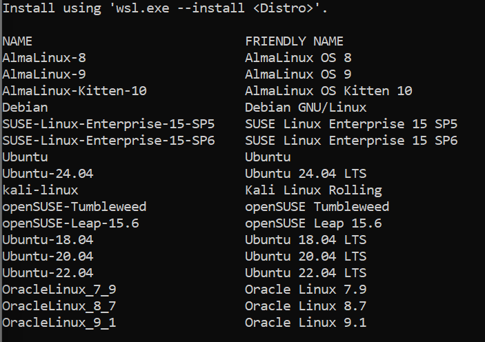
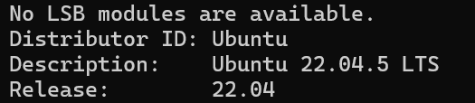

# Langkah-langkah Install WSL pada OS Windows

## Persyaratan
- Pastikan komputer/PC memiliki OS **Windows 10/11**.


## Langkah-langkah :
1. Buka CMD atau PowerShell -> Run as admistrator       
2. Tulis code sebagai berikut :
   ```sh
   wsl --install
3. Setelah kernel Linux ter-install tulis code ini untuk menampilkan list distro :
   ```sh
   wsl --list --online


4. Tulis code ini setelah menentukan distro yang akan digunakan :
   ```sh
   wsl --install -d <nama_distro>
5. Setup username dan password
6. Cari App "Ubuntu"/distro yang anda install
7. Cek versi Distro dengan code :
   ```sh
   lsb_release -a


   


 

